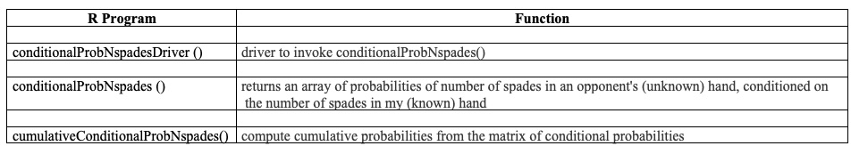
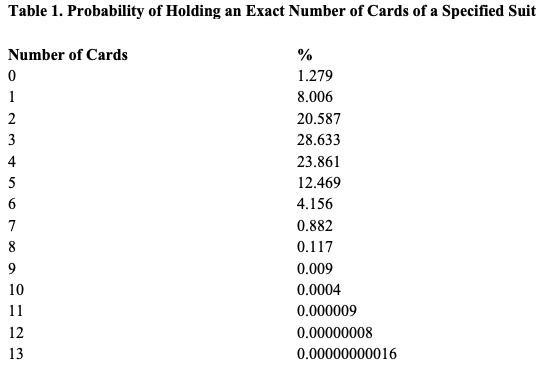
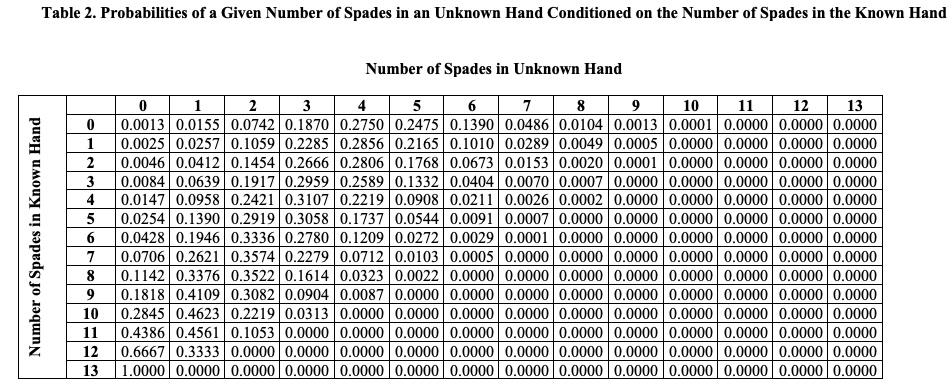
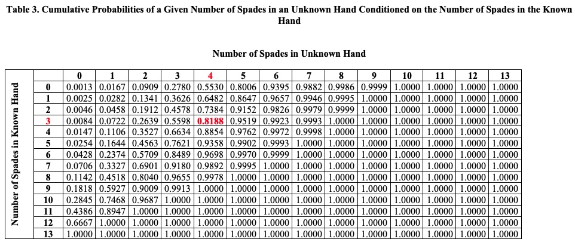
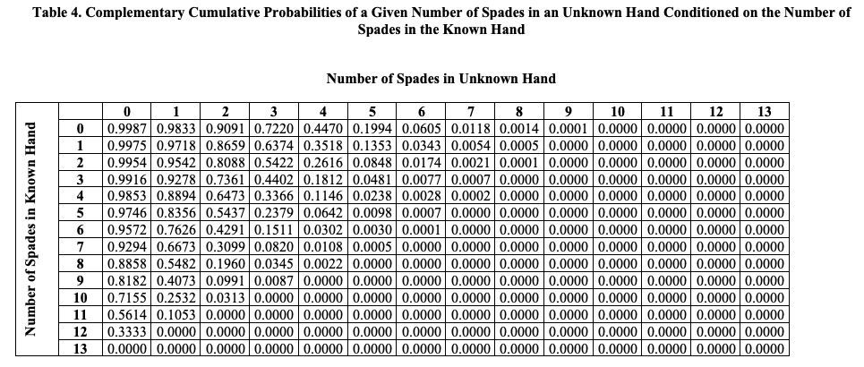

<b style='mso-bidi-font-weight:
normal'>ConditionalProbsNspades<o:p></o:p></b>

<b style='mso-bidi-font-weight:
normal'><o:p>&nbsp;</o:p></b>

<b style='mso-bidi-font-weight:
normal'><o:p>&nbsp;</o:p></b>

<b style='mso-bidi-font-weight:
normal'>Barry
Zeeberg<o:p></o:p></b>

<b style='mso-bidi-font-weight:
normal'>barryz2013@gmail.com<o:p></o:p></b>
 

**Motivation**

This package is primarily intended to provide some tabulated data to be be referred to in a discussion in a vignette accompanying my upcoming R package *playWholeHandDriverPassParams*. In addition to that specific purpose, these may also provide data and illustrate some computational approaches that are relevant to card games like hearts or bridge.

There are 3 programs in this package:

{width=100% height=100%}

**Probability of a Player Holding a Given Number of Cards of a Given Suit (*i.e.*, Spades)**

As a basis of checking my computations, I will refer to this Table 1 that shows authentic data from *https://gregstoll.com/~gregstoll/bridge/math.html*

{width=50% height=50%}

The details of performing the probability calculations are presented in *https://jlmartin.ku.edu/~jlmartin/bridge/basics.pdf*

These can be carried out using the R programming language console by means of the choose() function.
For example, the probability of holding 4 cards of a given suit computed by choose() matches the authentic table entry:

> choose(13,4)*choose(39,9)/choose(52,13)
[1] 0.238608

In English, this line is saying “Pick 4 spades out of 13 possible spades, then fill in the rest of the non-spades by picking the remaining 9 cards (that is, 4 spades + 9 non-spades = 13 card hand) from the 39 possible non-spades. This must be divided by the total number of possible hands (which are composed of picking any 13 cards from the entire deck of 52 cards).”

This calculation must be modified when I consider that I already know the 13 cards in my own hand. In the case that my hand has one spade, the R code becomes:

> choose(12,4)*choose(27,9)/choose(39,13)
[1] 0.2856263

This is saying “Pick 4 spades out of 12 possible spades [since I already have 1 spade, there are only 12 spades available for the other hand], then fill in the rest of the non-spades by picking the remaining 9 cards from the 27 possible non-spades [there is a total of 39 non-spades – 12 non-spades that I already hold = 27 available non-spades]. This must be divided by the total number of possible hands (which are composed of picking any 13 cards from the available 39 cards that are not already in my hand).”

The current probability value of 0.2856263 differs somewhat from that of the previous probability value 0.23861. The current value is conditioned on one spade in the known hand, whereas the previous value was not conditional. This difference can be used to provide an intuitive feel for the magnitude of the effect of incorporating prior knowledge.

The expected value for the number of spades dealt to one hand is 13/4 = 3.25. Our example of one spade in the known hand deviates quite a bit from the expected value. The probability, conditioned on 3 spades in the known hand, for 4 spades in the unknown hand is 0.2589. The probability, conditioned on 4 spades in the known hand, for 4 spades in the unknown hand is 0.2219. These 2 conditional probabilities bracket the unconditional probability of 0.238608. That is, when the number of spades in the known hand is close to the expected value, then the conditional probability for the unknown hand is close to the unconditional probability. This makes sense intuitively, since assuming the expected number of spades in the known hand is pretty much the same as not applying any additional information in calculating the conditional probability in the unknown hand. In contrast, assuming a value (such as 1 spade) that is far from the expected value of 3.25 will be expected to bias the conditional probability significantly.

In order to generalize these results, an R language program was written to calculate the probabilities of a given number of spades in an unknown hand conditioned on the number of spades in the known hand. The results are presented in Table 2. The probability entry corresponding to one spade in the known hand and 4 spades in the unknown hand is 0.2856, which matches the value in the example calculation given in the previous two paragraphs.

{width=125% height=125%}

The above probability was for exactly 4 spades. But we really want to know the probability for 4 or fewer spades, i.e., the cumulative probability. The cumulative probabilities, given in Table 3, were calculated by summing probabilities in Table 2. For example, the cumulative probability, conditioned on the known hand having one spade, for the unknown hand having four or fewer spades, is 0.6482. This probability value is equal to the sum of the probability values, conditioned on the known hand having one spade, for the unknown hand having 0 + 1 + 2 + 3 + 4 spades, in Table 2.

{width=125% height=125%}

The cumulative probability, conditioned on the known hand having one spade, for the unknown hand having five or more spades, is the complement to 0.6482, namely 1.0000 - the cumulative probability, conditioned on the known hand having one spade, for the unknown hand having four or fewer spades, is 0.6482. For convenience, these values are summarized in Table 4.

{width=125% height=125%}

As an example of the practical application of these probability tables, consider the case of a player being dealt a hand containing the QS. In general, the player might be inclined to retain the QS if the hand contains at least 5 spades, and to pass the QS if the hand contains 4 or fewer spades. We can make an educated guess about the situation based on the number of spades that we were dealt. For instance, if we were dealt 4 spades, then from Table 3 we can see the probability of an unknown hand holding 4 or fewer spades is 0.8854. So the chances are overwhelming that that player would pass the QS rather than hold it.

We can fine-tune this procedure a bit. For instance, if we were dealt 4 spades and then we were passed 1 spade, we have knowledge of the location of 5 spades, so the probabilities would be conditioned on 5 spades rather than 4. Similar considerations would apply if we were to pass a spade. This circumstance is interesting because we are using information that we receive *a posteriori* to estimate *a priori* conditioning for the unknown hand.

The take-home message can be seen by looking at the conditional probability values for 4 cards in the unknown hand in Table 3. Regardless of the number of spades in the known hand, this value is always greater than 50%, so our expectation is that an unknown hand is likely to have 4 or fewer spades. When the known hand contains a few spades, this value greatly exceeds 50%. Since we expect an unknown hand to contain 4 or fewer spades, we would expect a player who is dealt the QS to pass it most of the time.

